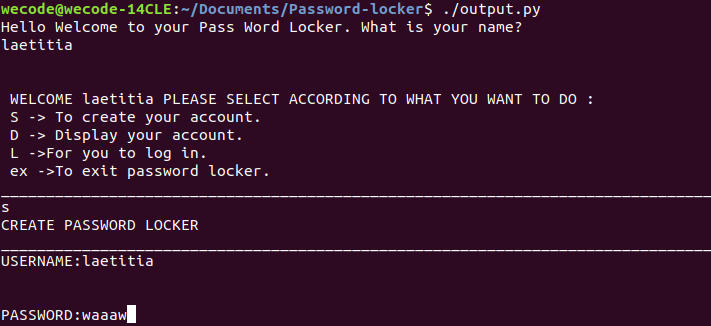

### PASSWORD LOCKER
#### By **Laetitia Uwizeyimana**
##
## Description
  Tthis is the project about password locker,
  it is the easy way of saving your password for different 
  social media account.

## BDD

>user has to enter and  create username and password to be used for this app wiwth c shortcode.

> whith shortcode d the created acount is displayed

>with shortcode l the user log in witht the created 
 
 

>if the password is wrong  the user can not enter to the app

>after login the user has to put his credential.

>The credentials have to saved

>The credentials created has to bedisplayed if the user want to see them.

>The app can generate password for user if he/she want. and to exit the user has two chose ex shortcode twice.

## Setup/Installation Requirements
     computer with Internet
     linux instalation 
     intall paython 3.6: sudo apt-get install python3.6
     install pip:sudo apt-get install python3-pip 
     install Pyperclip module :python3.6 -m pip install pyperclip

## Known Bugs
 The delete function is deleting all credentials instateof delete

## Technologies Used

    *paython3.6
   

## Support and contact details
Any contribution or support please contact me on my email:uwizelaetitia@gmail.com
### License

Copyright (c) 2019**Laetitia**